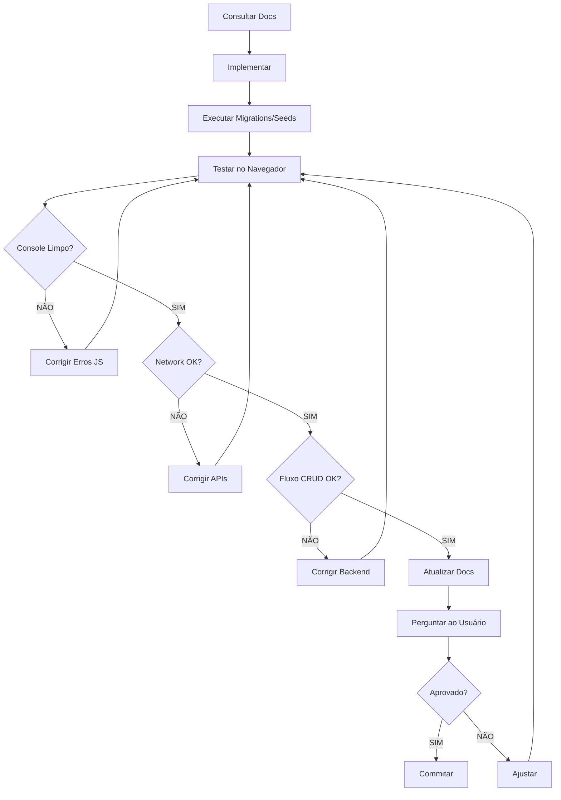

# ✅ CHECKLIST DE VALIDAÇÃO - EscalaMedica2

> **🎯 OBJETIVO**: Garantir que todas as implementações sejam testadas e validadas ANTES de commitar, evitando regressões e bugs em produção.

---

## 📋 CHECKLIST GERAL (TODA IMPLEMENTAÇÃO)

### 1️⃣ **Antes de Começar**
- [ ] Consultou `REGISTRY.md` para verificar nomenclaturas e padrões
- [ ] Consultou `MAPA_RELACIONAMENTOS.md` para entender impactos
- [ ] Verificou `REGRAS_DE_NEGOCIO.md` para validações necessárias
- [ ] Criou branch específica (se aplicável)
- [ ] Atualizou todo list com tarefas planejadas

### 2️⃣ **Durante a Implementação**
- [ ] Código segue padrões PSR-12
- [ ] Nomenclaturas seguem convenções do projeto
- [ ] Comentários claros em lógicas complexas
- [ ] Validações de entrada implementadas
- [ ] Tratamento de erros adequado (try-catch)
- [ ] Mensagens de erro/sucesso claras para usuário
- [ ] Logs adequados para debug

### 3️⃣ **Após Implementação (CRÍTICO)**
- [ ] **Executou migrations** (se criou novas tabelas)
- [ ] **Rodou seeders** (se criou dados de teste)
- [ ] **Testou no navegador** (abriu a página implementada)
- [ ] **Console do navegador limpo** (sem erros JavaScript - F12)
- [ ] **Network tab limpa** (requisições AJAX funcionando - F12)
- [ ] **Testou fluxo completo** (criação, edição, exclusão)
- [ ] **Testou em mobile** (responsividade)
- [ ] **Testou validações** (tentou enviar dados inválidos)

### 4️⃣ **Antes de Commitar**
- [ ] Rodou `php artisan test` (se testes existem)
- [ ] Verificou `get_errors` (sem erros de compilação)
- [ ] Atualizou documentação relevante
- [ ] Atualizou `REGISTRY.md` com novas entidades/rotas
- [ ] Atualizou `HISTORICO_COMMITS.md` com resumo
- [ ] **PERGUNTOU AO USUÁRIO**: "Posso commitar as alterações agora?"

---

## 🎨 CHECKLIST FRONTEND (Blade/JavaScript)

### Views Blade
- [ ] Meta tag CSRF presente: `<meta name="csrf-token" content="{{ csrf_token() }}">`
- [ ] Links CDN corretos (Bootstrap, jQuery, Select2, etc.)
- [ ] Scripts carregam na ordem correta (jQuery antes de plugins)
- [ ] Blade syntax correta: `{{ }}` para output, `@` para diretivas
- [ ] Escape de dados: `{{ }}` (escapado) vs `{!! !!}` (raw HTML)
- [ ] Formulários com `@csrf` token
- [ ] Rotas usando `route('name')` ou `url('/')`

### JavaScript
- [ ] Variáveis Blade renderizadas corretamente: `const id = {{ $variavel }};`
- [ ] Strings Blade com aspas corretas: `'{{ url("/rota") }}'`
- [ ] Console logs para debug (remover em produção)
- [ ] Try-catch em funções async
- [ ] Feedback visual durante loading (spinners, disabled buttons)
- [ ] Mensagens de erro claras para usuário
- [ ] Requisições AJAX com `X-CSRF-TOKEN` header

### Select2 / Dropdowns
- [ ] jQuery carregado ANTES do Select2
- [ ] Select2 inicializado DEPOIS do DOM carregar: `$(document).ready()`
- [ ] Tema Bootstrap configurado: `theme: 'bootstrap-5'`
- [ ] Placeholder definido
- [ ] Dados carregados via AJAX ou passados no `data` option
- [ ] Event listeners configurados: `.on('select2:select')`
- [ ] **TESTADO**: Dropdown abre e mostra itens

---

## 🔧 CHECKLIST BACKEND (Laravel)

### Migrations
- [ ] Nome segue padrão: `yyyy_mm_dd_hhmmss_action_table_name.php`
- [ ] Foreign keys com `onDelete('cascade')` ou `onDelete('restrict')`
- [ ] Unique constraints onde necessário
- [ ] Indexes em campos frequentemente consultados
- [ ] Método `down()` implementado (rollback)
- [ ] **EXECUTADA**: `php artisan migrate`

### Models
- [ ] Tabela definida: `protected $table = 'nome_tabela';`
- [ ] Fillable ou guarded configurado
- [ ] Casts para tipos especiais (date, boolean, array, etc.)
- [ ] Relacionamentos definidos (hasMany, belongsTo, etc.)
- [ ] Observers registrados (se necessário)
- [ ] Scopes úteis criados (se aplicável)

### Controllers
- [ ] Validação de dados: `$request->validate()`
- [ ] Transações DB em operações críticas: `DB::transaction()`
- [ ] Tratamento de exceções com try-catch
- [ ] Mensagens flash para usuário: `->with('success', 'Mensagem')`
- [ ] Redirect correto após ações
- [ ] Autorização/Policies (se aplicável)
- [ ] **TESTADO**: Todas as rotas funcionam

### Rotas (web.php)
- [ ] Nome da rota definido: `->name('nome.rota')`
- [ ] Middleware aplicado (se necessário)
- [ ] Parâmetros de rota corretos: `{model}`
- [ ] Resource routes usadas onde aplicável
- [ ] Rotas API em `api.php` (se for API)
- [ ] **TESTADO**: `php artisan route:list | grep nome`

### API Endpoints
- [ ] CSRF token verificado (web) ou sanctum (API)
- [ ] Headers corretos: `Content-Type: application/json`
- [ ] Respostas JSON consistentes: `response()->json()`
- [ ] Códigos HTTP corretos (200, 201, 400, 404, 500)
- [ ] Validação de entrada
- [ ] **TESTADO**: Requisição via Postman/Insomnia ou Browser

---

## 🗄️ CHECKLIST BANCO DE DADOS

### Estrutura
- [ ] Tabelas criadas corretamente
- [ ] Relacionamentos funcionando
- [ ] Constraints funcionando (unique, foreign key)
- [ ] Seeds carregam dados de teste
- [ ] **VERIFICADO**: `php artisan db:show`, `php artisan migrate:status`

### Queries
- [ ] Eager loading para evitar N+1: `->with('relacao')`
- [ ] Paginação em listagens: `->paginate(15)`
- [ ] Índices em campos pesquisados
- [ ] Transações em operações múltiplas
- [ ] **TESTADO**: Queries executam sem erro

---

## 🧪 CHECKLIST DE TESTES

### Testes Manuais (OBRIGATÓRIO)
1. **Abrir página no navegador**
   - URL acessível
   - Página carrega sem erro 500/404
   - Layout renderiza corretamente

2. **Console do Navegador (F12 → Console)**
   - Sem erros JavaScript (vermelho)
   - Sem warnings críticos (amarelo)
   - Logs de debug aparecem (se adicionados)

3. **Network Tab (F12 → Network)**
   - Requisições AJAX retornam 200 (sucesso)
   - Payloads JSON corretos
   - Sem requisições 404/500

4. **Fluxo CRUD Completo**
   - [ ] **C**reate: Formulário cria registro
   - [ ] **R**ead: Listagem mostra dados
   - [ ] **U**pdate: Edição salva alterações
   - [ ] **D**elete: Exclusão remove registro

5. **Validações**
   - [ ] Campos obrigatórios validados
   - [ ] Formatos corretos (email, data, etc.)
   - [ ] Mensagens de erro exibidas
   - [ ] Dados inválidos rejeitados

6. **Responsividade**
   - [ ] Desktop (1920x1080)
   - [ ] Tablet (768x1024)
   - [ ] Mobile (375x667)

### Testes Automatizados (se existem)
- [ ] `php artisan test` passa
- [ ] Coverage mínimo mantido
- [ ] Novos testes criados para novas features

---

## 🚨 CHECKLIST DE ERROS COMUNS

### JavaScript
- [ ] ❌ `Uncaught ReferenceError: $ is not defined` → jQuery não carregou
- [ ] ❌ `Uncaught TypeError: Cannot read property 'select2' of undefined` → Select2 não carregou
- [ ] ❌ `419 CSRF token mismatch` → Falta meta tag CSRF ou token no header
- [ ] ❌ `404 Not Found` em fetch() → Rota inexistente ou URL errada
- [ ] ❌ `500 Internal Server Error` → Erro PHP no backend (ver logs)

### Laravel
- [ ] ❌ `Class 'App\Models\X' not found` → Namespace errado ou classe não existe
- [ ] ❌ `SQLSTATE[42S02]: Base table not found` → Migration não executada
- [ ] ❌ `Call to undefined method` → Método não existe no model/controller
- [ ] ❌ `Route [name] not defined` → Rota não registrada em web.php

### Blade
- [ ] ❌ Variável renderiza literal `{{ $var }}` → Problema na sintaxe Blade
- [ ] ❌ `Undefined variable: var` → Variável não passada para view
- [ ] ❌ `Attempt to read property on null` → Relação não carregada (falta eager loading)

---

## 📝 TEMPLATE DE VALIDAÇÃO PRÉ-COMMIT

```markdown
## ✅ VALIDAÇÃO REALIZADA

### Implementação
- **Feature**: [Nome da feature implementada]
- **Arquivos Modificados**: [Lista de arquivos]
- **Migrations**: [Executadas? S/N]

### Testes Manuais
- [ ] Página abre no navegador
- [ ] Console limpo (F12)
- [ ] Network sem erros (F12)
- [ ] Fluxo CRUD completo testado
- [ ] Validações funcionando
- [ ] Responsividade OK

### Testes Específicos
- [ ] [Teste específico 1]
- [ ] [Teste específico 2]

### Documentação
- [ ] REGISTRY.md atualizado
- [ ] HISTORICO_COMMITS.md atualizado
- [ ] Outros docs relevantes atualizados

### Status Final
- **Bugs Encontrados**: [Nenhum / Lista de bugs]
- **Pronto para Commit**: [SIM / NÃO]
```

---

## 🔄 FLUXO IDEAL DE DESENVOLVIMENTO



---

## 🎯 RESPONSABILIDADES

### Desenvolvedor AI
1. Seguir TODOS os itens deste checklist
2. **NÃO commitar sem testar**
3. **NÃO assumir que "deve funcionar"**
4. **SEMPRE testar no navegador**
5. **SEMPRE verificar console/network**
6. **SEMPRE perguntar antes de commitar**

### Usuário
1. Revisar código proposto
2. Testar features implementadas
3. Aprovar ou solicitar ajustes
4. Autorizar commits

---

## 📊 MÉTRICAS DE QUALIDADE

### Meta: Zero Bugs em Produção
- **Commits sem bugs detectados**: __% (meta: 100%)
- **Testes manuais realizados**: __/__ (meta: 100%)
- **Documentação atualizada**: __% (meta: 100%)

---

**📍 Última atualização**: 2025-10-21  
**🔄 Revisão**: A cada implementação crítica
