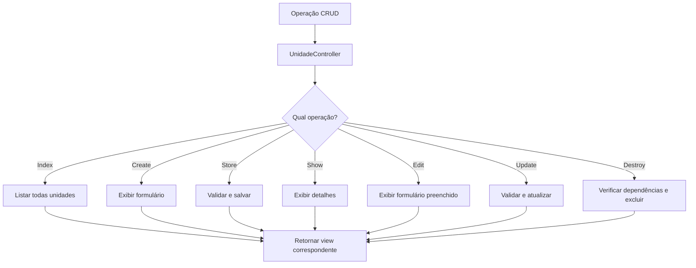
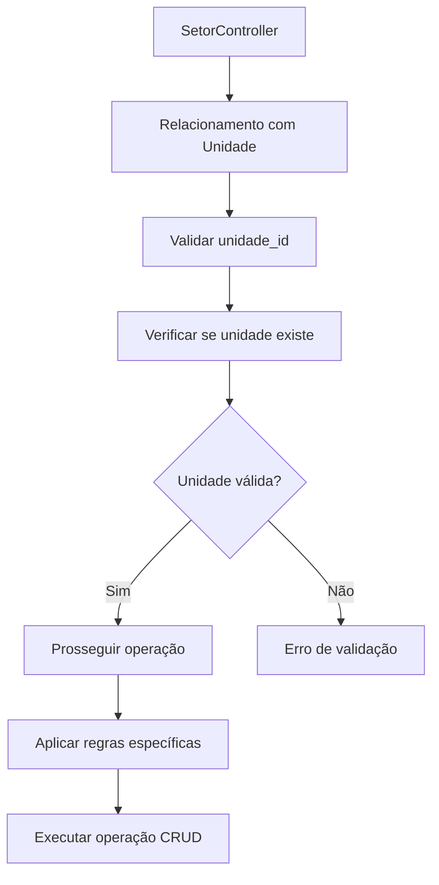
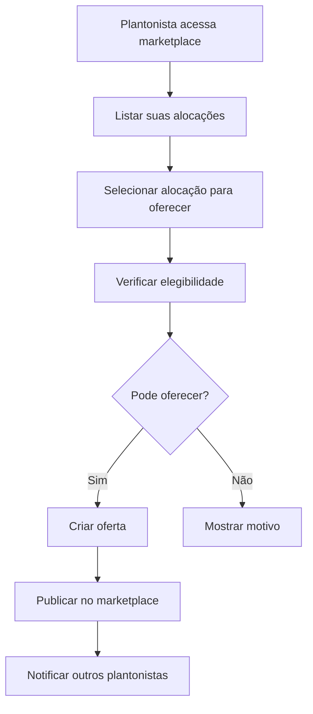
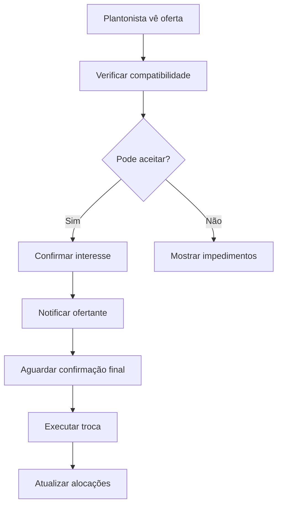
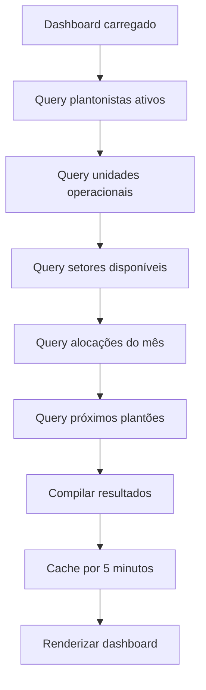
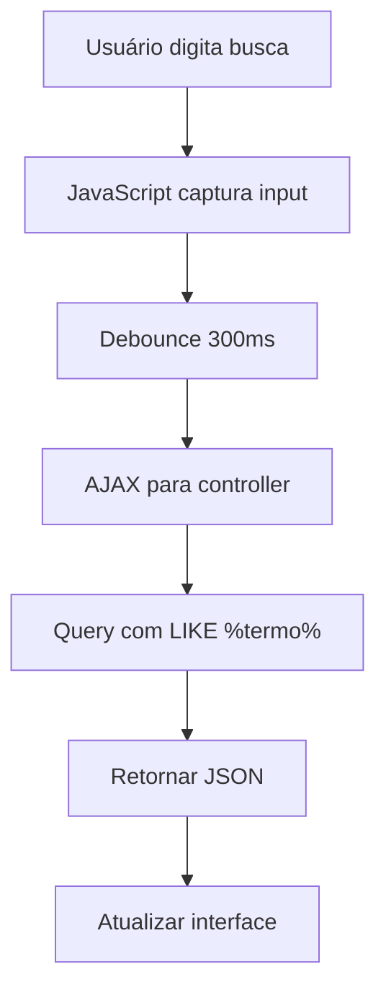
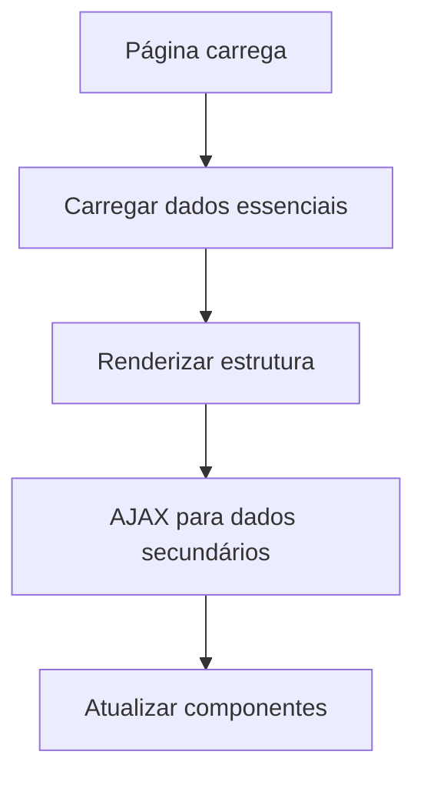
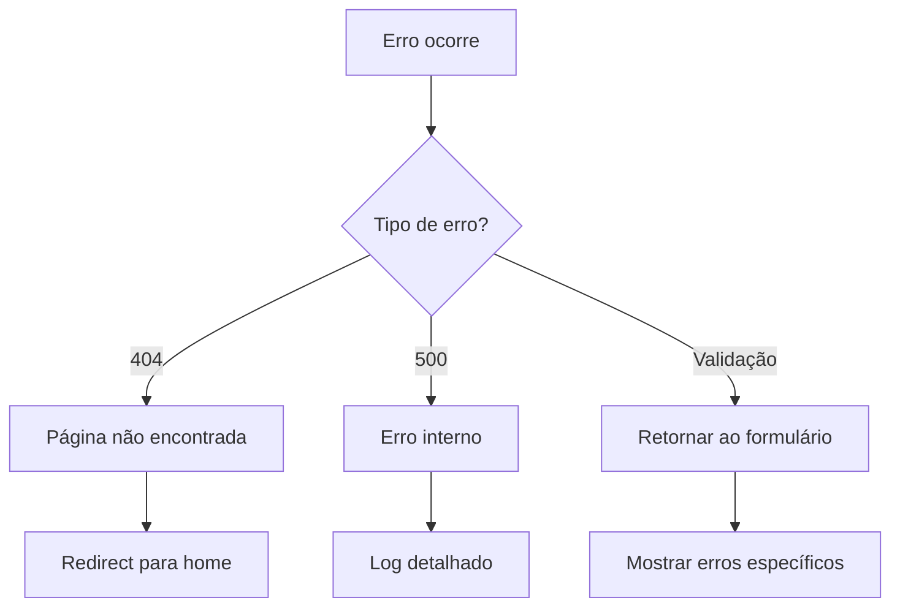

# 🔄 FLUXOS FUNCIONAIS - EscalaMedica2

> **Referenciado por**: `REGISTRY.md` → "Processos e Workflows"

---

## 🏠 FLUXO PRINCIPAL: DASHBOARD

```mermaid
graph TD
    A[Usuário acessa /dashboard] --> B[DashboardController@index]
    B --> C[Carregar estatísticas]
    C --> D[Contar plantonistas ativos]
    C --> E[Contar unidades operacionais]
    C --> F[Contar setores disponíveis]
    C --> G[Contar alocações do mês]
    C --> H[Calcular próximos plantões]
    D --> I[Compilar dados]
    E --> I
    F --> I
    G --> I
    H --> I
    I --> J[Renderizar dashboard.blade.php]
    J --> K[Exibir painel com estatísticas]
    K --> L[Links de acesso rápido]
```

### **Pontos de Entrada**
- Rota: `GET /dashboard`
- Controller: `DashboardController@index`
- View: `dashboard.blade.php`

### **Dados Processados**
- Total de plantonistas ativos
- Unidades operacionais
- Setores disponíveis
- Alocações do mês atual
- Próximos 5 plantões

---

## 👥 FLUXO CRUD: PLANTONISTAS

### **1. Listagem de Plantonistas**
```mermaid
graph TD
    A[GET /plantonistas] --> B[PlantonistaController@index]
    B --> C[Buscar todos plantonistas]
    C --> D[Aplicar paginação 10 itens]
    D --> E[Renderizar index.blade.php]
    E --> F[Exibir tabela com dados]
    F --> G[Botões de ação CRUD]
```

### **2. Criação de Plantonista**
```mermaid
graph TD
    A[GET /plantonistas/create] --> B[PlantonistaController@create]
    B --> C[Renderizar formulário create.blade.php]
    C --> D[Usuário preenche dados]
    D --> E[POST /plantonistas]
    E --> F[PlantonistaController@store]
    F --> G[Validar dados obrigatórios]
    G --> H{Validação OK?}
    H -->|Sim| I[Salvar no banco]
    H -->|Não| J[Retornar erros]
    I --> K[Redirect para index]
    J --> L[Mostrar erros no formulário]
```

### **3. Visualização de Plantonista**
```mermaid
graph TD
    A[GET /plantonistas/{id}] --> B[PlantonistaController@show]
    B --> C[Buscar plantonista por ID]
    C --> D{Encontrou?}
    D -->|Sim| E[Renderizar show.blade.php]
    D -->|Não| F[404 Not Found]
    E --> G[Exibir dados detalhados]
    G --> H[Links para editar/excluir]
```

### **4. Edição de Plantonista**
```mermaid
graph TD
    A[GET /plantonistas/{id}/edit] --> B[PlantonistaController@edit]
    B --> C[Buscar plantonista por ID]
    C --> D[Renderizar edit.blade.php]
    D --> E[Formulário preenchido]
    E --> F[PUT /plantonistas/{id}]
    F --> G[PlantonistaController@update]
    G --> H[Validar alterações]
    H --> I{Validação OK?}
    I -->|Sim| J[Atualizar registro]
    I -->|Não| K[Retornar erros]
    J --> L[Redirect para show]
    K --> M[Mostrar erros]
```

### **5. Exclusão de Plantonista**
```mermaid
graph TD
    A[DELETE /plantonistas/{id}] --> B[PlantonistaController@destroy]
    B --> C[Verificar dependências]
    C --> D{Tem alocações?}
    D -->|Sim| E[Bloquear exclusão]
    D -->|Não| F[Confirmar exclusão]
    E --> G[Mensagem de erro]
    F --> H[Excluir registro]
    H --> I[Redirect para index]
```

---

## 🏥 FLUXO CRUD: UNIDADES

### **Processo Padrão**


### **Validações Específicas**
- Nome obrigatório e único
- Endereço obrigatório
- Telefone opcional
- Status padrão: Ativo

---

## 🏢 FLUXO CRUD: SETORES

### **Características Especiais**


### **Regras de Negócio**
- Setor deve pertencer a uma unidade válida
- Nome único dentro da mesma unidade
- Capacidade máxima opcional

---

## ⏰ FLUXO CRUD: TURNOS

### **Validação de Horários**
```mermaid
graph TD
    A[TurnoController@store/update] --> B[Validar hora_inicio]
    B --> C[Validar hora_fim]
    C --> D[Calcular duração]
    D --> E{Duração válida?}
    E -->|Sim| F[Verificar sobreposições]
    E -->|Não| G[Erro: duração inválida]
    F --> H{Tem conflitos?}
    H -->|Não| I[Salvar turno]
    H -->|Sim| J[Erro: conflito de horários]
```

### **Cálculos Automáticos**
- Duração em horas entre início e fim
- Detecção de turnos noturnos (cruzam meia-noite)
- Validação de intervalos mínimos

---

## 📅 FLUXO COMPLETO: ALOCAÇÕES

### **1. Criação de Alocação**
```mermaid
graph TD
    A[Usuário acessa create] --> B[Carregar listas]
    B --> C[Plantonistas disponíveis]
    B --> D[Unidades ativas]
    B --> E[Setores da unidade]
    B --> F[Turnos disponíveis]
    C --> G[Renderizar formulário]
    D --> G
    E --> G
    F --> G
    G --> H[Usuário preenche dados]
    H --> I[Submit formulário]
    I --> J[AlocacaoController@store]
```

### **2. Validações da Alocação**
```mermaid
graph TD
    A[AlocacaoController@store] --> B[Validar campos obrigatórios]
    B --> C[ValidacaoAlocacao@passes]
    C --> D[Verificar se plantonista existe]
    D --> E[Verificar se unidade ativa]
    E --> F[Verificar se setor pertence à unidade]
    F --> G[Verificar se turno existe]
    G --> H[Verificar conflitos de horário]
    H --> I{Todas validações OK?}
    I -->|Sim| J[Salvar alocação]
    I -->|Não| K[Retornar erros específicos]
    J --> L[Trigger Observer]
    L --> M[Redirect com sucesso]
```

### **3. Observer de Alocação**
```mermaid
graph TD
    A[Alocação salva] --> B[AlocacaoObserver@created]
    B --> C[Log da operação]
    C --> D[Calcular estatísticas]
    D --> E[Atualizar cache]
    E --> F[Notificar sistemas externos]
```

---

## 🔄 FLUXO MARKETPLACE: TROCAS

### **1. Oferecer Plantão**


### **2. Aceitar Troca**


---

## 📊 FLUXO RELATÓRIOS E ESTATÍSTICAS

### **Dashboard Statistics**


### **Queries Otimizadas**
- Uso de `whereHas` para relacionamentos
- Contadores eficientes com `count()`
- Cache de consultas frequentes
- Paginação automática em listagens

---

## 🔍 FLUXO BUSCA E FILTROS

### **Busca Geral**


### **Filtros Avançados**
- Filtro por especialização
- Filtro por data/período
- Filtro por unidade/setor
- Filtro por status

---

## ⚡ FLUXOS DE PERFORMANCE

### **Carregamento Lazy**


### **Cache Strategy**
- Cache de queries por 5 minutos
- Cache de estatísticas por 10 minutos
- Invalidação automática em updates
- Cache de sessão para formulários

---

## 🚨 FLUXOS DE ERRO

### **Tratamento Global**


### **Recovery Strategies**
- Auto-retry para falhas temporárias
- Fallback para dados em cache
- Notificação para administradores
- Logs detalhados para debugging

---

*Fluxos funcionais completos do EscalaMedica2*
*Última atualização: 2024-12-28*
*Total de fluxos documentados: 15*