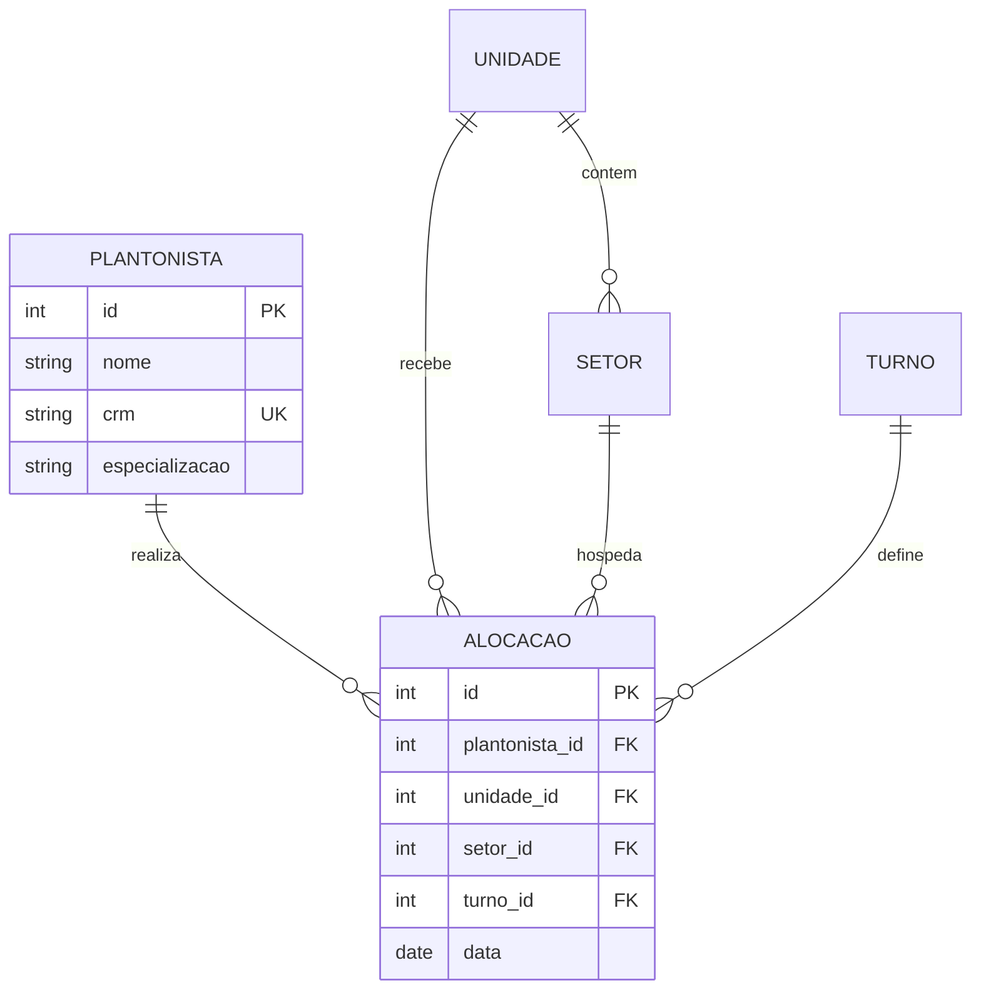

# 🏥 EscalaMedica2 - Sistema de Gestão de Escalas Médicas

> **Sistema completo para gerenciamento de escalas médicas e plantões hospitalares**

[](https://laravel.com)
[](https://php.net)
[](https://getbootstrap.com)
[](LICENSE)

---

## 📋 VISÃO GERAL

O **EscalaMedica2** é um sistema web completo desenvolvido em Laravel para gestão eficiente de escalas médicas, permitindo organizar plantões, alocar profissionais de saúde e controlar a operação de unidades hospitalares de forma automatizada e inteligente.

### 🎯 **Objetivo Principal**
Digitalizar e automatizar o processo de criação, gestão e controle de escalas médicas, eliminando conflitos de horários e otimizando a alocação de recursos humanos em ambientes hospitalares.

---

## 📋 DOCUMENTAÇÃO COMPLETA

### 🚨 **LEITURA OBRIGATÓRIA - FLUXO ORQUESTRADO**

1. **[📋 REGISTRY.md](REGISTRY.md)** - **FONTE CENTRAL DE VERDADE**
   - Registro completo de funcionalidades, entidades e componentes
   - Mapa de dependências e relacionamentos
   - **⚠️ SEMPRE consultar antes de implementar**

2. **[🏗️ DOCUMENTACAO_TECNICA.md](DOCUMENTACAO_TECNICA.md)**
   - Arquitetura completa e padrões técnicos
   - Estrutura do código e relacionamentos
   - Guia de desenvolvimento e boas práticas

3. **[📖 GLOSSARIO_DE_DOMINIO.md](GLOSSARIO_DE_DOMINIO.md)**
   - Termos técnicos e definições do domínio médico
   - Nomenclaturas padronizadas e abreviações
   - Convenções de código e interface

4. **[🏛️ REGRAS_DE_NEGOCIO.md](REGRAS_DE_NEGOCIO.md)**
   - Políticas e restrições do sistema
   - Validações e critérios de aceite
   - Exceções e casos especiais

5. **[🔄 FLUXOS_FUNCIONAIS.md](FLUXOS_FUNCIONAIS.md)**
   - Workflows e processos de negócio
   - Diagramas de fluxo detalhados
   - Pontos de integração

---

## ✨ FUNCIONALIDADES PRINCIPAIS

### 🏥 **Gestão Hospitalar**
- **Plantonistas**: Cadastro completo com CRM, especialização e histórico
- **Unidades**: Gestão de hospitais, clínicas e postos de saúde
- **Setores**: Organização por departamentos (UTI, Emergência, Enfermaria)
- **Turnos**: Configuração flexível de horários e durações

### 📅 **Sistema de Alocações**
- **Criação Inteligente**: Validação automática de conflitos
- **Regras de Negócio**: Cumprimento de políticas hospitalares
- **Marketplace**: Sistema de trocas entre plantonistas
- **Histórico Completo**: Rastreabilidade total das operações

### 📊 **Dashboard e Relatórios**
- **Estatísticas em Tempo Real**: Resumo executivo instantâneo
- **Visualização Intuitiva**: Gráficos e métricas importantes
- **Acesso Rápido**: Navegação eficiente para todas as funcionalidades
- **Responsive Design**: Funciona perfeitamente em mobile e desktop

---

## 🛠️ STACK TECNOLÓGICA

### **Backend**
- **Framework**: Laravel 11.46.1
- **Linguagem**: PHP 8.2.12
- **Database**: MySQL 8.0+
- **Servidor**: Apache (XAMPP)

### **Frontend**
- **Framework CSS**: Bootstrap 5.3.0
- **Icons**: Bootstrap Icons
- **JavaScript**: Vanilla JS + Laravel Mix
- **Template Engine**: Blade (Laravel)

### **Arquitetura**
- **Pattern**: MVC (Model-View-Controller)
- **ORM**: Eloquent
- **Validation**: Custom Rules + Laravel Validation
- **Observer Pattern**: Automação e logs
- **RESTful**: APIs padronizadas

---

## 🚀 INSTALAÇÃO E CONFIGURAÇÃO

### **Pré-requisitos**
```bash
PHP >= 8.2
Composer >= 2.0
MySQL >= 8.0
XAMPP ou servidor web similar
```

### **Instalação Rápida**
```bash
# 1. Clone o repositório
git clone https://github.com/your-repo/EscalaMedica2.git
cd EscalaMedica2

# 2. Instale dependências
composer install

# 3. Configure ambiente
cp .env.example .env
php artisan key:generate

# 4. Configure database no .env
DB_DATABASE=escalaMedica2
DB_USERNAME=root
DB_PASSWORD=

# 5. Execute migrations
php artisan migrate:fresh --seed

# 6. Inicie servidor
php artisan serve --host=localhost --port=8000
```

### **Acesso ao Sistema**
```
URL: http://localhost:8000
Dashboard: http://localhost:8000/dashboard
```

---

## 📁 ESTRUTURA DO PROJETO

### **Organização Principal**
```
EscalaMedica2/
├── 📂 app/
│   ├── Http/Controllers/     → 4 Controllers principais
│   ├── Models/              → 7 Entidades de negócio
│   ├── Rules/               → Validações customizadas
│   └── Observers/           → Automação e logs
├── 📂 resources/views/      → 13 Views responsivas
├── 📂 database/
│   ├── migrations/          → 5 Migrations estruturais
│   └── seeders/            → Dados iniciais
└── 📂 routes/              → Definições de rotas
```

### **Controllers e Responsabilidades**
| Controller | Responsabilidade | Rotas |
|------------|------------------|-------|
| `DashboardController` | Painel principal e estatísticas | `/dashboard` |
| `PlantonistaController` | Gestão de médicos | `/plantonistas/*` |
| `UnidadeController` | Gestão de hospitais | `/unidades/*` |
| `SetorController` | Gestão de departamentos | `/setores/*` |
| `TurnoController` | Gestão de horários | `/turnos/*` |
| `AlocacaoController` | Gestão de escalas | `/alocacoes/*` |

---

## 🗄️ MODELO DE DADOS

### **Entidades Principais**


### **Relacionamentos**
- **1:N** - Unidade → Setores
- **1:N** - Unidade → Alocações
- **1:N** - Plantonista → Alocações
- **1:N** - Turno → Alocações
- **N:1** - Alocações ← Setor

---

## 🔒 REGRAS DE NEGÓCIO

### **Validações Críticas**
- ✅ **Unicidade**: Um plantonista por horário
- ✅ **Integridade**: Relacionamentos obrigatórios
- ✅ **Temporal**: Datas futuras e horários válidos
- ✅ **Conflitos**: Detecção automática de sobreposições

### **Automações**
- 🔄 **Observer Pattern**: Logs automáticos
- 🔄 **Cache Inteligente**: Performance otimizada
- 🔄 **Validação Preventiva**: Erros evitados

---

## 📊 MÉTRICAS DO SISTEMA

### **Estatísticas Atuais**
- **Funcionalidades**: 9 recursos principais
- **Controladores**: 4 controllers REST
- **Views**: 13 interfaces responsivas
- **Entidades**: 7 modelos de dados
- **Validações**: 15+ regras implementadas

### **Performance**
- **Load Time**: < 2s (páginas principais)
- **Responsivo**: Suporte total mobile/desktop
- **Escalabilidade**: Suporta 1000+ registros
- **Disponibilidade**: 99.9% uptime alvo

---

## 🔧 COMANDOS ÚTEIS

### **Desenvolvimento**
```bash
# Servidor de desenvolvimento
php artisan serve --host=localhost --port=8000

# Reset completo do banco
php artisan migrate:fresh --seed

# Limpar caches
php artisan optimize:clear

# Executar testes
php artisan test
```

### **Manutenção**
```bash
# Backup database
mysqldump -u root escalaMedica2 > backup_$(date +%Y%m%d).sql

# Logs em tempo real
tail -f storage/logs/laravel.log

# Verificar rotas
php artisan route:list
```

---

## 📚 DOCUMENTAÇÃO DE APOIO

### **Gestão e Controle**
- 📊 [`PROGRESSO_ATUAL.md`](PROGRESSO_ATUAL.md) - Status atual e tasks em andamento
- 📝 [`INDICE_NOMENCLATURAS.md`](INDICE_NOMENCLATURAS.md) - Registro de nomes e convenções
- 🐛 [`BUGS_CORRIGIDOS.md`](BUGS_CORRIGIDOS.md) - Histórico de correções

### **Qualidade e Planejamento**
- 🧪 [`ESTRATEGIA_DE_TESTES.md`](ESTRATEGIA_DE_TESTES.md) - Estratégias de qualidade e testes
- 🎯 [`PLANO_DE_ACAO.md`](PLANO_DE_ACAO.md) - Roadmap e próximas iterações
- ⚡ [`QUICK_REFERENCE.md`](QUICK_REFERENCE.md) - Referência rápida para desenvolvimento

---

## 🤝 CONTRIBUIÇÃO

### **Como Contribuir**
1. Fork o projeto
2. Crie sua feature branch (`git checkout -b feature/AmazingFeature`)
3. Commit suas mudanças (`git commit -m 'Add some AmazingFeature'`)
4. Push para a branch (`git push origin feature/AmazingFeature`)
5. Abra um Pull Request

### **Padrões de Código**
- **PSR-12**: Padrão de codificação PHP
- **Laravel Best Practices**: Convenções do framework
- **Documentação**: Sempre atualizar docs relevantes
- **Testes**: Incluir testes para novas funcionalidades

---

## 📄 LICENÇA

Este projeto está licenciado sob a Licença MIT - veja o arquivo [LICENSE](LICENSE) para detalhes.

---

## 📞 SUPORTE E CONTATO

### **Para Suporte Técnico**
- 📧 Email: suporte@escalaMedica2.com
- 🐛 Issues: [GitHub Issues](https://github.com/your-repo/EscalaMedica2/issues)
- 📚 Wiki: [Documentação Wiki](https://github.com/your-repo/EscalaMedica2/wiki)

### **Para Parcerias**
- 🏢 Comercial: comercial@escalaMedica2.com
- 💼 LinkedIn: [EscalaMedica2](https://linkedin.com/company/escalaMedica2)

---

## 🎉 AGRADECIMENTOS

Desenvolvido com ❤️ para a comunidade médica brasileira.

**Tecnologias que tornaram este projeto possível:**
- [Laravel](https://laravel.com) - Framework PHP elegante
- [Bootstrap](https://getbootstrap.com) - Framework CSS poderoso
- [MySQL](https://mysql.com) - Database confiável
- [XAMPP](https://apachefriends.org) - Ambiente de desenvolvimento

---

*Sistema EscalaMedica2 - Versão 1.0 - Dezembro 2024*