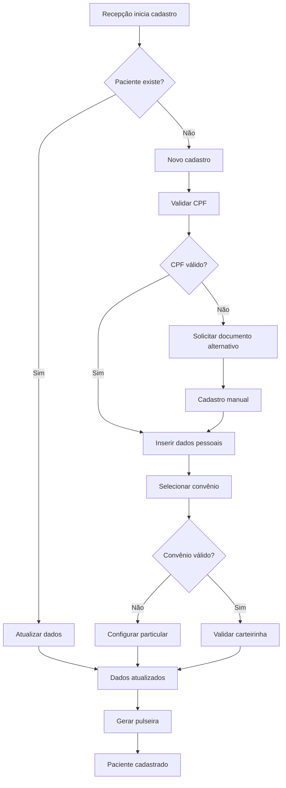
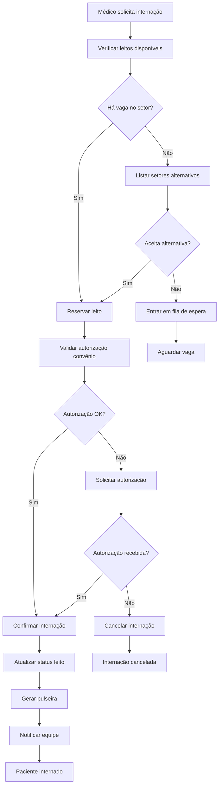
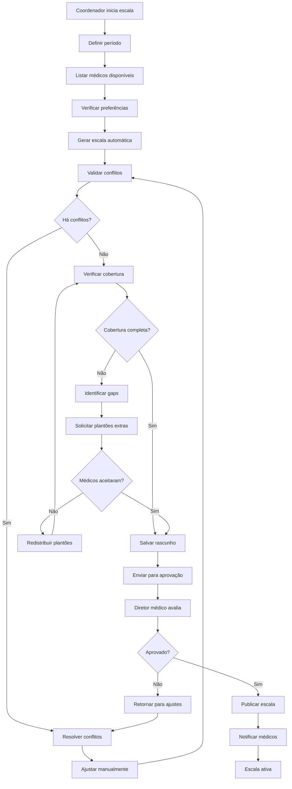
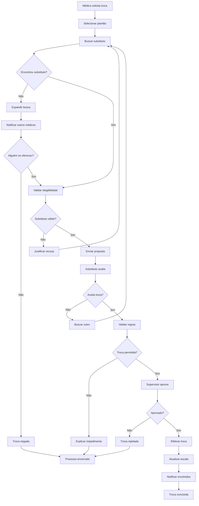
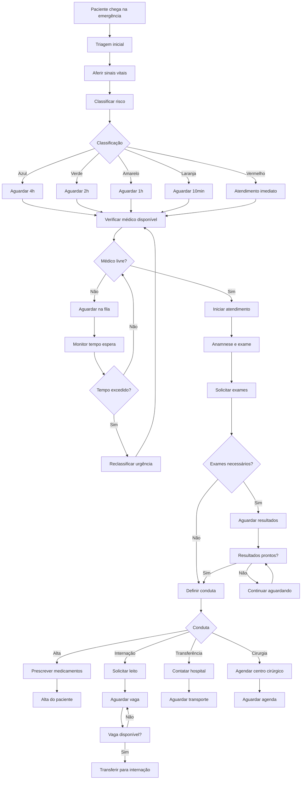
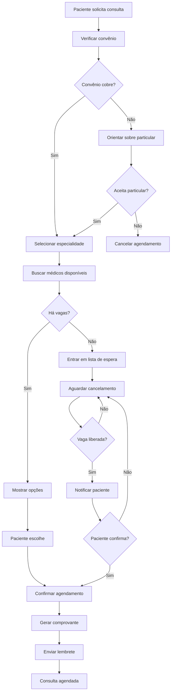
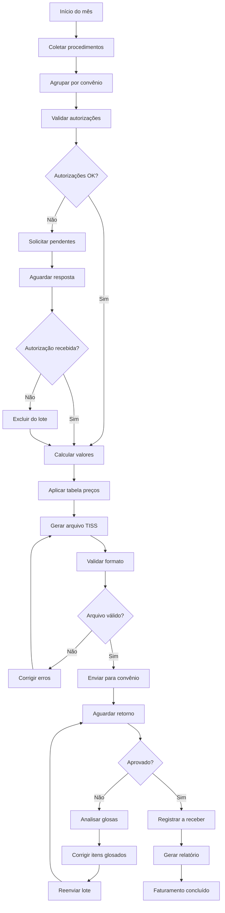
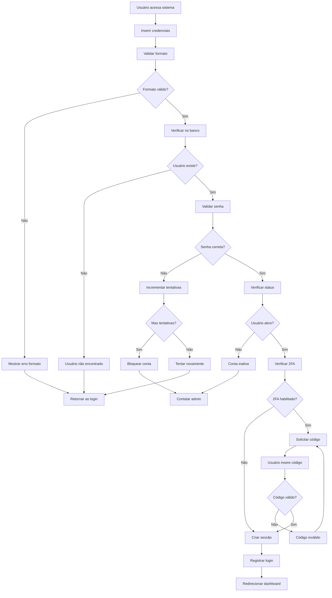

# 🔄 Fluxos Funcionais - EscalaMedica2

> **Objetivo**: Documentar os fluxos principais do sistema, mostrando a sequência de ações, decisões e integrações entre módulos para facilitar desenvolvimento, testes e auditoria.

## 📊 Informações dos Fluxos
- **Sistema**: EscalaMedica2
- **Total de Fluxos**: 8 principais
- **Última Atualização**: 2025-10-20
- **Formato**: Diagrama textual + BPMN descritivo

---

## 📋 Índice
- [🏥 Fluxos de Admissão](#-fluxos-de-admissão)
- [📅 Fluxos de Escalas](#-fluxos-de-escalas)
- [🩺 Fluxos de Atendimento](#-fluxos-de-atendimento)
- [💰 Fluxos Financeiros](#-fluxos-financeiros)
- [🔐 Fluxos de Segurança](#-fluxos-de-segurança)
- [📊 Fluxos de Gestão](#-fluxos-de-gestão)

---

## 🏥 Fluxos de Admissão

### 🚪 F001 - Cadastro de Paciente

#### Detalhes do Fluxo:
- **Ator Principal**: Recepcionista
- **Pré-condições**: Sistema funcionando, recepcionista autenticado
- **Pós-condições**: Paciente cadastrado com número único
- **Tempo Médio**: 3-5 minutos
- **Sistemas Integrados**: SUS (validação CPF), Convênios (validação carteirinha)

#### Regras Aplicadas:
- RN003: Validação de CPF obrigatória
- RN016: Verificar cobertura do convênio
- RN019: Log de auditoria para cadastros

#### Pontos de Falha:
- API do SUS indisponível → Permitir cadastro manual
- Sistema de convênio offline → Marcar para validação posterior
- Duplicação de paciente → Merge automático com confirmação

---

### 🏥 F002 - Internação de Paciente

#### Detalhes do Fluxo:
- **Ator Principal**: Médico assistente
- **Atores Secundários**: Recepção, Enfermagem
- **Tempo Médio**: 15-30 minutos
- **Sistemas Integrados**: Sistema de leitos, Convênios, Notificações

#### Regras Aplicadas:
- RN005: Verificar capacidade do setor
- RN006: Leito ocupado não pode ser usado
- RN017: Autorização para procedimentos caros

---

## 📅 Fluxos de Escalas

### 📋 F003 - Criação de Escala Mensal

#### Detalhes do Fluxo:
- **Ator Principal**: Coordenador de escalas
- **Aprovador**: Diretor médico
- **Prazo**: Até 25 do mês anterior
- **Sistemas Integrados**: Email, SMS, Sistema de preferências

#### Regras Aplicadas:
- RN008: Validar plantões sobrepostos
- RN009: Verificar limite de horas
- RN010: Respeitar intervalo entre plantões
- RN011: Garantir cobertura completa

---

### 🔄 F004 - Troca de Plantão

#### Detalhes do Fluxo:
- **Ator Principal**: Médico solicitante
- **Tempo Limite**: 48h antes do plantão
- **Aprovação**: Supervisor do setor

#### Regras Aplicadas:
- RN008: Validar sobreposição
- RN009: Verificar limite de horas de ambos
- RN010: Respeitar intervalo mínimo

---

## 🩺 Fluxos de Atendimento

### 🚑 F005 - Atendimento de Emergência

#### Detalhes do Fluxo:
- **Ator Principal**: Equipe de emergência
- **Tempo Crítico**: Conforme classificação Manchester
- **Sistemas Integrados**: Laboratório, Radiologia, Internação

#### Regras Aplicadas:
- RN012: Triagem obrigatória
- RN013: Tempos por classificação
- RN014: Médico da especialidade quando possível

---

### 📅 F006 - Agendamento de Consulta

#### Detalhes do Fluxo:
- **Ator Principal**: Recepcionista ou Paciente (online)
- **Antecedência Mínima**: 24 horas
- **Sistema Integrado**: Email, SMS, Convênios

#### Regras Aplicadas:
- RN015: Não agendar no passado
- RN016: Verificar cobertura do convênio

---

## 💰 Fluxos Financeiros

### 💳 F007 - Faturamento Mensal

#### Detalhes do Fluxo:
- **Responsável**: Equipe financeira
- **Prazo**: Até 5º dia útil
- **Sistemas Integrados**: TISS, Sistema dos convênios

#### Regras Aplicadas:
- RN017: Verificar autorizações necessárias
- RN018: Respeitar prazo de fechamento

---

## 🔐 Fluxos de Segurança

### 🔐 F008 - Login e Autenticação

#### Detalhes do Fluxo:
- **Tempo de Sessão**: 30 minutos inatividade
- **Máximo Tentativas**: 5 tentativas
- **2FA**: Obrigatório para administradores

#### Regras Aplicadas:
- RN003: Senha forte obrigatória
- RN004: Bloqueio por inatividade
- RN021: Expiração de sessão

---

## 📊 Uso dos Fluxos

### 👩‍💻 Para Desenvolvedores
1. **Implementação**: Use os fluxos como base para desenvolvimento
2. **Validação**: Verifique se o código segue o fluxo documentado
3. **Testes**: Crie cenários de teste baseados nos fluxos
4. **Debug**: Use fluxos para rastrear problemas

### 🧪 Para QA
1. **Cenários de Teste**: Cada fluxo gera múltiplos cenários
2. **Caminhos Alternativos**: Teste todos os "Não" dos fluxos
3. **Pontos de Falha**: Foque nos pontos críticos identificados
4. **Integração**: Valide integração entre sistemas

### 📋 Para Product Owners
1. **Validação**: Confirme se fluxo atende requisitos
2. **Otimização**: Identifique gargalos e melhorias
3. **Comunicação**: Use para explicar funcionalidades
4. **Aprovação**: Base para aceitar/rejeitar implementações

### 👥 Para Stakeholders
1. **Entendimento**: Visualize como o sistema funciona
2. **Impacto**: Entenda como mudanças afetam processos
3. **Treinamento**: Base para capacitação de usuários
4. **Auditoria**: Rastree conformidade com processos

---

## 🔄 Manutenção dos Fluxos

### ✅ Quando Atualizar
- Nova funcionalidade implementada
- Mudança em regra de negócio
- Integração com novo sistema
- Otimização de processo
- Feedback dos usuários

### 📝 Como Atualizar
1. **Identificar Mudança**: O que mudou no processo
2. **Mapear Impacto**: Quais fluxos são afetados
3. **Atualizar Diagrama**: Modificar passos e decisões
4. **Validar Regras**: Verificar regras de negócio relacionadas
5. **Comunicar**: Informar equipe sobre mudanças

### 🎯 Métricas dos Fluxos
- **Tempo Médio**: Quanto tempo cada fluxo demora
- **Taxa de Sucesso**: % de fluxos concluídos com sucesso
- **Pontos de Falha**: Onde os fluxos mais falham
- **Gargalos**: Etapas que mais demoram

---

## 📞 Ferramentas Recomendadas

### 🎨 Para Diagramação
- **Mermaid**: Texto → Diagrama (usado neste doc)
- **Draw.io**: Editor visual gratuito
- **Lucidchart**: Ferramenta profissional
- **Bizagi**: Específico para BPMN

### 🔗 Para Integração
- **Postman**: Testar APIs dos fluxos
- **Insomnia**: Alternativa ao Postman
- **Swagger**: Documentar APIs
- **Newman**: Automatizar testes de API

---

**📍 Última atualização**: 2025-10-20  
**👥 Responsáveis**: Product Owner + Tech Lead + Analistas de Processo  
**📋 Status**: Fluxos principais mapeados - detalhar conforme implementação  
**🔄 Próxima revisão**: A cada nova funcionalidade ou mudança de processo

> **💡 Dica**: Use estes fluxos como base para criar user stories e casos de teste!